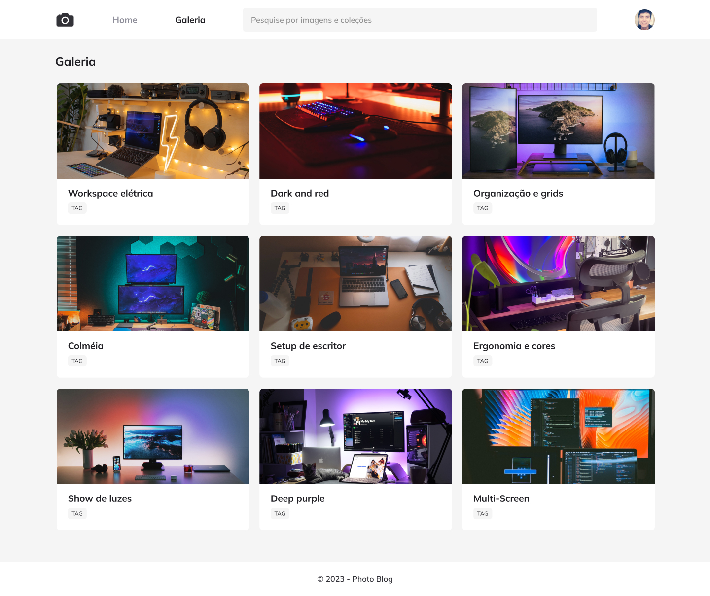

<h1 align="center">Photo Blog</h1>

  

## 🚀 Tecnologias

Esse projeto foi desenvolvido com as seguintes tecnologias:

- HTML
- CSS

## 💻 Projeto

Um projeto da página inicial de foto blog que usei para estudar conceitos mais avançados de CSS incluindo animações no template.

---

Feito com ♥ by Cleber-Risu
